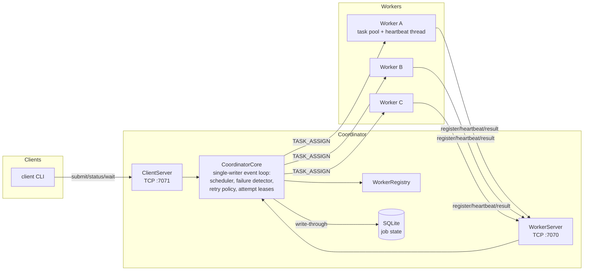
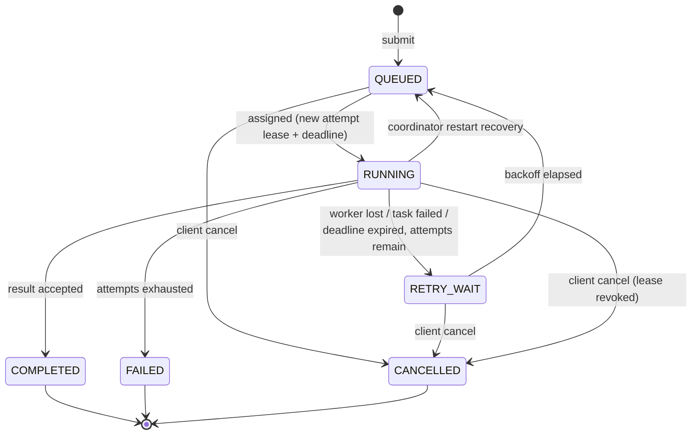

# Distributed Task Processor

A fault-tolerant distributed task-processing system in Java 21: a single
**Coordinator** schedules jobs onto multiple **Workers** over a hand-built TCP
protocol, detects worker failures through heartbeats, retries and reassigns
lost work under **at-least-once** semantics protected by **attempt leases**,
and recovers its state from **SQLite** after a restart.

The core distributed-systems mechanisms — including protocol framing,
scheduling, failure detection, retry/lease handling, persistence, and
recovery — are implemented directly in this repository rather than delegated
to messaging or workflow frameworks. There is no Kafka, no RabbitMQ, no
workflow engine, and no RPC framework; understanding these mechanisms is the
purpose of the project.

## Why this exists

The system is built around one demonstration:

1. A client submits a long-running job.
2. The Coordinator assigns it to Worker A.
3. Worker A is killed with `SIGKILL` mid-execution.
4. The Coordinator notices A's heartbeats stop (or its connection drop),
   invalidates the attempt, and schedules a retry.
5. Worker B executes the job to completion.
6. The client sees the job `COMPLETED` on attempt 2, and the logs tell the
   whole story.

`./scripts/demo-failure-recovery.sh` runs exactly this against the real
system — nothing is simulated.

## Architecture



- **common** — protocol messages (sealed hierarchy, JSON), length-prefixed
  frame codec, job state machine, payload validation.
- **coordinator** — worker registry, single-threaded core (all state
  mutations), scheduler, heartbeat failure detector, retry policy with
  exponential backoff, SQLite repository, recovery, two TCP servers.
- **worker** — registration, reconnect loop, bounded task pool, dedicated
  heartbeat thread, five built-in task types.
- **client** — CLI (`submit`, `status`, `wait`, `list`, `workers`) and a small
  reusable client library.
- **integration-tests** — end-to-end tests, including worker failure,
  stale results, coordinator restart, admission control, and concurrency safety.

### Job lifecycle



Every assignment carries a fresh **attempt lease** (a UUID) that is
**time-bounded**: it expires at a deadline measured on the coordinator's clock
(`assignedAt + executionTimeout`). A result is only accepted if it carries the
job's *current* lease — results from workers that were declared dead, timed
out, or cancelled, and later resurface, are logged and rejected. When a lease
expires the coordinator revokes it, best-effort asks the worker to stop
(`TASK_CANCEL`), and retries the job. See
[docs/FAILURE_MODEL.md](docs/FAILURE_MODEL.md).

## Requirements

- JDK 21+ (build is `--release 21`)
- Nothing else — the Maven Wrapper downloads Maven itself (network access is
  required for the first build).

## Build and test

```bash
./mvnw clean verify        # compiles everything, runs unit + integration tests
```

The integration tests start real coordinators and workers in-process on
ephemeral ports with millisecond-scale timeouts, so the whole suite runs in
well under a minute.

## Running locally

```bash
./scripts/build.sh                     # build runnable jars once

# Terminal 1
./scripts/coordinator.sh

# Terminals 2-4
./scripts/worker.sh --id worker-1
./scripts/worker.sh --id worker-2
./scripts/worker.sh --id worker-3

# Terminal 5
./scripts/client.sh submit sleep --milliseconds 30000
./scripts/client.sh status <job-id>
./scripts/client.sh wait <job-id>
./scripts/client.sh cancel <job-id>
./scripts/client.sh list
./scripts/client.sh workers
./scripts/client.sh bench --jobs 2000 --concurrency 4   # load generator
```

Task types: `sleep --milliseconds N`, `word-count --text "..."`,
`sha256 --text "..."`, `prime-count --limit N`, and
`fail --fail-until-attempt N` (deliberately fails early attempts, for watching
retries). Run any command without arguments to see usage.

**Execution deadlines.** Each attempt has a coordinator-enforced execution
deadline (`--task-timeout-millis`, default 10 minutes). A task that outlives it
is treated like a lost attempt — the lease is revoked, the worker is asked to
stop, and the job is retried — even if the worker is alive and heartbeating.
This closes the gap where one wedged task would otherwise occupy a slot
forever. To watch it, start the coordinator with a short timeout and submit a
longer sleep:

```bash
./scripts/coordinator.sh --task-timeout-millis 3000
./scripts/client.sh submit sleep --milliseconds 20000   # exceeds the 3s deadline
```

## Load generation and overload control

The client includes a small concurrent load generator for measuring the system
against itself:

```bash
./scripts/client.sh bench --jobs 2000 --concurrency 4 --task sha256
```

It submits the requested jobs across `--concurrency` independent connections
(one blocking client per thread), waits for every job to reach a terminal state,
and reports throughput, submit-acknowledgement latency, and end-to-end
submit-to-terminal latency as p50/p95/p99, plus accepted/rejected counts. It is
a **local engineering benchmark** for comparing configurations, not a rigorous
performance benchmark — see [docs/MEASURED_BEHAVIOR.md](docs/MEASURED_BEHAVIOR.md)
for methodology, honest limitations, and the measured numbers below.

**Admission control (backpressure).** The coordinator holds at most
`--max-active-jobs` active (non-terminal: `QUEUED` + `RETRY_WAIT` + `RUNNING`)
jobs, defaulting to 10 000. A submission that arrives at the limit is **rejected
with a typed `SUBMIT_REJECTED` reply** (distinct from a malformed-request error,
and marked retryable) rather than being buffered — the coordinator sheds excess
load instead of letting its queue and memory grow without bound. The active-job
count is an O(1) counter maintained inside the single-writer core, so the
admission check stays cheap even under heavy load. Overload semantics:

- Only **new** submissions are admission-controlled; work already in the system
  is never discarded.
- **Retries never re-enter admission control** — a retrying job is already
  counted as active and stays counted across `RUNNING → RETRY_WAIT → RUNNING`.
- Completion, permanent failure, and cancellation each free exactly one slot.
- After a restart the coordinator may hold **more active jobs than a
  since-lowered limit**; the recovered jobs run to completion normally, and only
  *new* submissions are rejected until the count falls back below the limit.

The client **surfaces** a rejection by default (one-shot submit). It can also
**opt in** to bounded, jittered retry of *retryable* rejections — see
[client-side submission retry](#client-side-submission-retry) below.

Watch it shed load with no workers running (jobs stay `QUEUED`, so they stay
active):

```bash
./scripts/coordinator.sh --max-active-jobs 3
./scripts/client.sh submit sleep --milliseconds 60000   # x4; the 4th is rejected
```

**Client-side submission retry.** By default the client makes exactly one
submission attempt and surfaces a `SUBMIT_REJECTED` to the caller (unchanged
behavior). Passing `--submit-retries N` lets it re-attempt admission up to `N`
times **after** the first attempt (so `N + 1` attempts total; `N = 0` is the
default one-shot):

```bash
./scripts/client.sh submit sha256 --text abc --submit-retries 4
# tune the back-off: --submit-retry-base-millis 200 --submit-retry-max-millis 5000
```

- It retries **only** a typed `SUBMIT_REJECTED` whose `retryable` flag is true.
  A malformed-request error, a protocol violation, or any transport failure is
  **never** retried — a dropped connection is ambiguous about whether the job
  was created, so a blind resend could submit it twice. Retrying a *rejection*
  is safe because a rejection provably creates and persists nothing.
- Back-off is bounded exponential with **full jitter**
  (`random in [0, min(cap, base·2^(n-1))]`), so many clients rejected at once do
  not retry in lockstep. When the budget is exhausted the caller still receives
  the typed `SubmitRejectedException`.
- This is purely a **client** convenience; the wire protocol and coordinator are
  unchanged, and it is distinct from the coordinator's *execution* retries.
- The **benchmark deliberately does not retry** — it measures raw admission
  shedding, so its accepted/rejected counts stay directly comparable.

**Durable idempotent submission.** A client may attach a stable
`--idempotency-key` to a submission. The coordinator remembers `key → jobId`
(persisted on the job row, so it survives restart), and a later submission with
the same key returns the **original** job id instead of creating another job:

```bash
./scripts/client.sh submit sha256 --text abc --idempotency-key order-42
./scripts/client.sh submit sha256 --text abc --idempotency-key order-42  # same job id, no new job
```

- The key is **optional**; omitting it is exactly today's behavior (every
  submission is a fresh job). It is checked **before** admission control, so a
  known key returns its job even at `--max-active-jobs` (it adds no active job);
  a genuinely new key is admission-controlled as normal.
- The mapping holds for the job's whole life, **including terminal states** — a
  completed, failed, or cancelled key returns that same job and never re-runs it.
  A key is therefore "burned" once its job is terminal; use a new key to run
  again.
- Reusing a key with a **different** task type, payload, or max attempts is a
  conflict (`ERROR`); the existing job is left untouched.
- This deduplicates **submission**, not execution — execution stays
  at-least-once. It is the precondition for safely auto-retrying transport
  failures, but that retry is intentionally **not** enabled in this milestone.
  Because there is no client authentication, keys share one global namespace —
  use unguessable, namespaced keys (e.g. UUIDs).

**Measured overload behavior** (Apple M1 Pro, 3 workers × capacity 4 = 12 slots,
240× 500 ms sleep jobs from 8 connections; full methodology in the doc):

| | Unbounded (baseline) | `--max-active-jobs 24` |
|---|---|---|
| Accepted / rejected | 240 / 0 | 24 / 216 |
| End-to-end latency p99 | ~10.0 s | ~1.0 s |

The change does not raise peak throughput (that was always the honest 12-slot
ceiling of ~24 jobs/s); it makes overload **defined** — admitted work has
bounded latency, and excess load is refused explicitly instead of silently
queued.

## The failure-recovery demo

```bash
./scripts/demo-failure-recovery.sh
```

Real output from a run of this script (job id shortened):

```
==> Job is RUNNING on: worker-1
==> Killing worker-1 with SIGKILL (pid 94624)
==> Waiting for the coordinator to detect the failure and reassign...
Job 79446e9f…
  State:    RUNNING
  Attempt:  2/3
  Worker:   worker-2
  Error:    worker worker-1 lost (connection lost: connection closed)
...
Job 79446e9f…
  State:    COMPLETED
  Attempt:  2/3
  Result:   slept 20000 ms
```

And the coordinator log tells the same story:

```
Job assigned: jobId=79446e9f… workerId=worker-1 attempt=1/3 attemptId=7c739ce2…
Worker connection lost: workerId=worker-1 reason=connection closed
Retry scheduled: jobId=79446e9f… attempt=1/3 delayMillis=1000 cause="worker worker-1 lost …"
Job requeued after backoff: jobId=79446e9f… attempt=1/3
Job assigned: jobId=79446e9f… workerId=worker-2 attempt=2/3 attemptId=523b02fc…
Job completed: jobId=79446e9f… workerId=worker-2 attempts=2
```

A `SIGKILL`ed process drops its TCP connection, so detection is immediate. To
see the pure heartbeat-timeout path (a *hung* worker whose socket stays open),
pause a worker with `kill -STOP <pid>`; after the configured 6-second timeout
the coordinator declares it dead and reassigns. Both paths are also covered by
integration tests.

## Coordinator restart recovery

Job state is written through to SQLite on every transition. If the coordinator
process dies and restarts on the same database:

- terminal jobs (`COMPLETED`/`FAILED`) keep their results and errors;
- jobs that were `RUNNING` are requeued (the crashed attempt still counts
  against the budget) or failed if it was their final attempt — the outcome of
  the interrupted attempt is unknown, which is exactly the at-least-once
  trade-off;
- workers reconnect on their own and re-register.

Try it: start the stack, submit a long job, `Ctrl-C` the coordinator, restart
it, and watch the job finish.

## Docker

A multi-stage `Dockerfile` and a `docker-compose.yml` (one coordinator, three
workers, job database on a named volume) are included:

```bash
docker compose up --build
```

**Note:** the Docker configuration has not yet been runtime-verified — the
development machine does not have Docker installed. Local Java execution is
the primary, fully verified path; treat Compose as unverified convenience
until you have run it yourself. Once running, `docker compose kill worker-1`
during a job is intended to reproduce the same reassignment story across
containers.

## Testing

- **Unit tests** (per module): frame codec edge cases (partial reads,
  malformed and oversized lengths), protocol round-trips and unknown-type
  rejection, job state machine legality, attempt-lease validity, retry
  backoff, worker registry capacity accounting, SQLite persistence, task
  implementations against known vectors.
- **Integration tests** (`integration-tests/`): basic execution,
  multi-worker spread and true concurrency (asserted by elapsed time), worker
  failure via heartbeat silence *and* via abrupt disconnect, retry exhaustion,
  stale-result rejection in three variants, coordinator restart recovery
  (including the final-attempt rule, the stale-deadline rule, and worker
  auto-reconnect), execution-deadline timeout on a healthy worker with
  reassignment, client cancellation of queued and running jobs, a
  60-jobs/4-clients/5-workers scheduling race test asserting exactly one
  assignment per job, malformed-bytes robustness on both ports, and admission
  control (accept-to-limit then typed rejection, slot accounting across
  completion / failure / cancellation / retry, an 8-client race admitting
  exactly the limit, and recovery of the active-job count including above a
  lowered limit).

## Semantics, honestly stated

- **At-least-once execution.** If a worker completes a task but dies before
  its result reaches the coordinator, the job is retried and may execute
  twice. Externally side-effecting tasks would need to be idempotent; the
  built-in tasks are pure.
- **Not exactly-once**, and no claim of it. Attempt leases guarantee only that
  *coordinator state* is never corrupted by duplicate or stale results.
- **Failure suspicion, not proof.** A missed heartbeat means the worker is
  *suspected* dead under a timeout model; a slow-but-alive worker can be
  declared dead. Its late results are then rejected as stale.
- **Execution deadline ≠ worker death.** A timed-out attempt means the *task*
  exceeded its execution contract, not that the worker failed — the worker may
  be healthy and heartbeating. Expiry is judged solely on the coordinator's
  clock, so worker clocks need not be synchronized. The revoked attempt's late
  result is rejected through the same lease check.
- **Cancellation is cooperative.** `cancel` and deadline expiry revoke the lease
  immediately and ask the worker to stop via thread interruption; a task that
  ignores interruption keeps running but can no longer affect job state. This is
  not guaranteed preemption, and it does not make execution exactly-once.
- **Overload is shed, not absorbed.** Beyond `--max-active-jobs` the
  coordinator refuses new submissions with a typed, retryable `SUBMIT_REJECTED`
  rather than queueing them. This bounds the coordinator's memory and the
  latency of admitted work; it does *not* raise throughput, and it applies only
  to new work — jobs already in the system always run to a terminal state. The
  client can opt in to bounded, jittered retry of these rejections
  (`--submit-retries`), which never resends on an ambiguous transport failure.
- **Single coordinator.** The coordinator is a single point of failure;
  durability (not availability) is what restart recovery provides. Multiple
  coordinators would require leader election/consensus — out of scope, by
  design.

More detail in [docs/FAILURE_MODEL.md](docs/FAILURE_MODEL.md) and
[docs/DESIGN_DECISIONS.md](docs/DESIGN_DECISIONS.md).

## Limitations and future work

- Plaintext TCP with no authentication — production use would need TLS and
  worker authentication.
- One coordinator (see above); leader election is the natural next step.
- Scheduling is FIFO / least-loaded; no priorities, deadlines, or fairness.
- Results live in the job row; large results would need external storage.
- Admission is a single global active-job limit (`--max-active-jobs`); there is
  no per-client fairness or priority in what gets shed. The client surfaces
  rejections by default and can opt in to bounded, jittered retry
  (`--submit-retries`), but this only reschedules the client's own attempts — it
  adds no capacity and, under sustained overload, only shifts where the load is
  shed.
- Cancellation is cooperative (thread interruption), not hard preemption: a
  task that ignores interruption keeps running until it finishes, though its
  lease is already revoked so its result is discarded.
- Idempotent submission (`--idempotency-key`) deduplicates *submissions*, not
  execution — execution remains at-least-once. Keys share one global namespace
  (there is no client authentication to scope them), and a key is bound to its
  job for the job's whole life, so a terminal key cannot be reused to run again.
  Automatic retry of ambiguous transport failures is not yet enabled; the key is
  the groundwork that would make it safe.

## Documentation

- [docs/ARCHITECTURE.md](docs/ARCHITECTURE.md) — components, thread model, data ownership
- [docs/PROTOCOL.md](docs/PROTOCOL.md) — framing, message schemas, error handling
- [docs/FAILURE_MODEL.md](docs/FAILURE_MODEL.md) — failure scenarios and guarantees
- [docs/DESIGN_DECISIONS.md](docs/DESIGN_DECISIONS.md) — ADR-style rationale
- [docs/MEASURED_BEHAVIOR.md](docs/MEASURED_BEHAVIOR.md) — load-generator methodology and measured throughput / overload behavior
