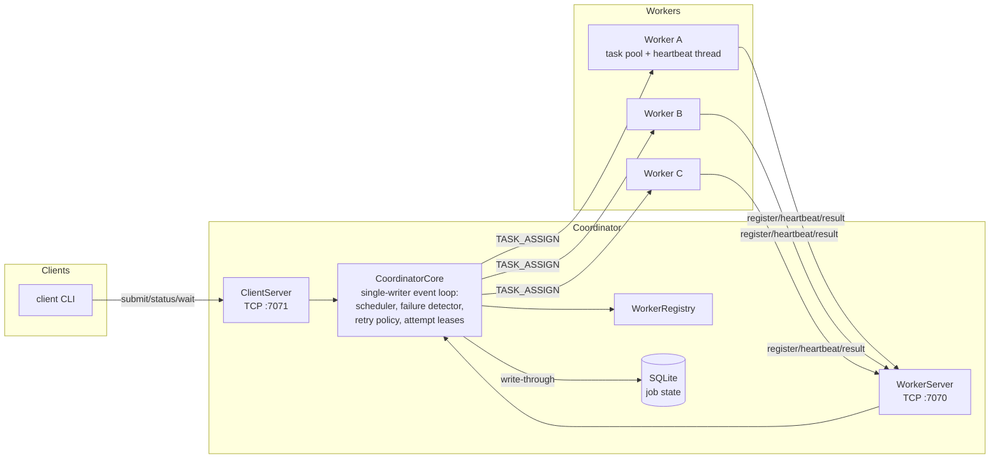
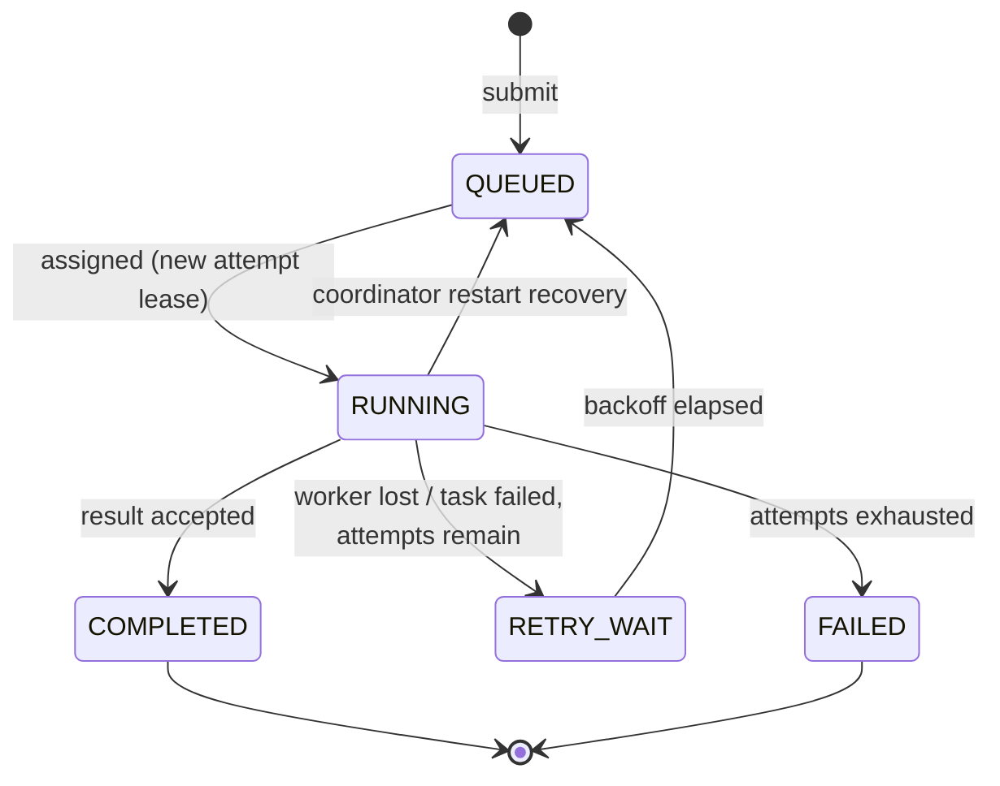

# Distributed Task Processor

A fault-tolerant distributed task-processing system in Java 21: a single
**Coordinator** schedules jobs onto multiple **Workers** over a hand-built TCP
protocol, detects worker failures through heartbeats, retries and reassigns
lost work under **at-least-once** semantics protected by **attempt leases**,
and recovers its state from **SQLite** after a restart.

The core distributed-systems mechanisms — including protocol framing,
scheduling, failure detection, retry/lease handling, persistence, and
recovery — are implemented directly in this repository rather than delegated
to messaging or workflow frameworks. There is no Kafka, no RabbitMQ, no
workflow engine, and no RPC framework; understanding these mechanisms is the
purpose of the project.

## Why this exists

The system is built around one demonstration:

1. A client submits a long-running job.
2. The Coordinator assigns it to Worker A.
3. Worker A is killed with `SIGKILL` mid-execution.
4. The Coordinator notices A's heartbeats stop (or its connection drop),
   invalidates the attempt, and schedules a retry.
5. Worker B executes the job to completion.
6. The client sees the job `COMPLETED` on attempt 2, and the logs tell the
   whole story.

`./scripts/demo-failure-recovery.sh` runs exactly this against the real
system — nothing is simulated.

## Architecture



- **common** — protocol messages (sealed hierarchy, JSON), length-prefixed
  frame codec, job state machine, payload validation.
- **coordinator** — worker registry, single-threaded core (all state
  mutations), scheduler, heartbeat failure detector, retry policy with
  exponential backoff, SQLite repository, recovery, two TCP servers.
- **worker** — registration, reconnect loop, bounded task pool, dedicated
  heartbeat thread, five built-in task types.
- **client** — CLI (`submit`, `status`, `wait`, `list`, `workers`) and a small
  reusable client library.
- **integration-tests** — 18 end-to-end tests, including worker failure,
  stale results, coordinator restart, and concurrency safety.

### Job lifecycle



Every assignment carries a fresh **attempt lease** (a UUID). A result is only
accepted if it carries the job's *current* lease — results from workers that
were declared dead and later resurface are logged and rejected. See
[docs/FAILURE_MODEL.md](docs/FAILURE_MODEL.md).

## Requirements

- JDK 21+ (build is `--release 21`)
- Nothing else — the Maven Wrapper downloads Maven itself (network access is
  required for the first build).

## Build and test

```bash
./mvnw clean verify        # compiles everything, runs unit + integration tests
```

The integration tests start real coordinators and workers in-process on
ephemeral ports with millisecond-scale timeouts, so the whole suite runs in
well under a minute.

## Running locally

```bash
./scripts/build.sh                     # build runnable jars once

# Terminal 1
./scripts/coordinator.sh

# Terminals 2-4
./scripts/worker.sh --id worker-1
./scripts/worker.sh --id worker-2
./scripts/worker.sh --id worker-3

# Terminal 5
./scripts/client.sh submit sleep --milliseconds 30000
./scripts/client.sh status <job-id>
./scripts/client.sh wait <job-id>
./scripts/client.sh list
./scripts/client.sh workers
```

Task types: `sleep --milliseconds N`, `word-count --text "..."`,
`sha256 --text "..."`, `prime-count --limit N`, and
`fail --fail-until-attempt N` (deliberately fails early attempts, for watching
retries). Run any command without arguments to see usage.

## The failure-recovery demo

```bash
./scripts/demo-failure-recovery.sh
```

Real output from a run of this script (job id shortened):

```
==> Job is RUNNING on: worker-1
==> Killing worker-1 with SIGKILL (pid 94624)
==> Waiting for the coordinator to detect the failure and reassign...
Job 79446e9f…
  State:    RUNNING
  Attempt:  2/3
  Worker:   worker-2
  Error:    worker worker-1 lost (connection lost: connection closed)
...
Job 79446e9f…
  State:    COMPLETED
  Attempt:  2/3
  Result:   slept 20000 ms
```

And the coordinator log tells the same story:

```
Job assigned: jobId=79446e9f… workerId=worker-1 attempt=1/3 attemptId=7c739ce2…
Worker connection lost: workerId=worker-1 reason=connection closed
Retry scheduled: jobId=79446e9f… attempt=1/3 delayMillis=1000 cause="worker worker-1 lost …"
Job requeued after backoff: jobId=79446e9f… attempt=1/3
Job assigned: jobId=79446e9f… workerId=worker-2 attempt=2/3 attemptId=523b02fc…
Job completed: jobId=79446e9f… workerId=worker-2 attempts=2
```

A `SIGKILL`ed process drops its TCP connection, so detection is immediate. To
see the pure heartbeat-timeout path (a *hung* worker whose socket stays open),
pause a worker with `kill -STOP <pid>`; after the configured 6-second timeout
the coordinator declares it dead and reassigns. Both paths are also covered by
integration tests.

## Coordinator restart recovery

Job state is written through to SQLite on every transition. If the coordinator
process dies and restarts on the same database:

- terminal jobs (`COMPLETED`/`FAILED`) keep their results and errors;
- jobs that were `RUNNING` are requeued (the crashed attempt still counts
  against the budget) or failed if it was their final attempt — the outcome of
  the interrupted attempt is unknown, which is exactly the at-least-once
  trade-off;
- workers reconnect on their own and re-register.

Try it: start the stack, submit a long job, `Ctrl-C` the coordinator, restart
it, and watch the job finish.

## Docker

A multi-stage `Dockerfile` and a `docker-compose.yml` (one coordinator, three
workers, job database on a named volume) are included:

```bash
docker compose up --build
```

**Note:** the Docker configuration has not yet been runtime-verified — the
development machine does not have Docker installed. Local Java execution is
the primary, fully verified path; treat Compose as unverified convenience
until you have run it yourself. Once running, `docker compose kill worker-1`
during a job is intended to reproduce the same reassignment story across
containers.

## Testing

- **Unit tests** (per module): frame codec edge cases (partial reads,
  malformed and oversized lengths), protocol round-trips and unknown-type
  rejection, job state machine legality, attempt-lease validity, retry
  backoff, worker registry capacity accounting, SQLite persistence, task
  implementations against known vectors.
- **Integration tests** (`integration-tests/`): basic execution,
  multi-worker spread and true concurrency (asserted by elapsed time), worker
  failure via heartbeat silence *and* via abrupt disconnect, retry exhaustion,
  stale-result rejection in three variants, coordinator restart recovery
  (including the final-attempt rule and worker auto-reconnect), a
  60-jobs/4-clients/5-workers scheduling race test asserting exactly one
  assignment per job, and malformed-bytes robustness on both ports.

## Semantics, honestly stated

- **At-least-once execution.** If a worker completes a task but dies before
  its result reaches the coordinator, the job is retried and may execute
  twice. Externally side-effecting tasks would need to be idempotent; the
  built-in tasks are pure.
- **Not exactly-once**, and no claim of it. Attempt leases guarantee only that
  *coordinator state* is never corrupted by duplicate or stale results.
- **Failure suspicion, not proof.** A missed heartbeat means the worker is
  *suspected* dead under a timeout model; a slow-but-alive worker can be
  declared dead. Its late results are then rejected as stale.
- **Single coordinator.** The coordinator is a single point of failure;
  durability (not availability) is what restart recovery provides. Multiple
  coordinators would require leader election/consensus — out of scope, by
  design.

More detail in [docs/FAILURE_MODEL.md](docs/FAILURE_MODEL.md) and
[docs/DESIGN_DECISIONS.md](docs/DESIGN_DECISIONS.md).

## Limitations and future work

- Plaintext TCP with no authentication — production use would need TLS and
  worker authentication.
- One coordinator (see above); leader election is the natural next step.
- Scheduling is FIFO / least-loaded; no priorities, deadlines, or fairness.
- Results live in the job row; large results would need external storage.
- No cancellation, backpressure, or per-task execution timeout yet.

## Documentation

- [docs/ARCHITECTURE.md](docs/ARCHITECTURE.md) — components, thread model, data ownership
- [docs/PROTOCOL.md](docs/PROTOCOL.md) — framing, message schemas, error handling
- [docs/FAILURE_MODEL.md](docs/FAILURE_MODEL.md) — failure scenarios and guarantees
- [docs/DESIGN_DECISIONS.md](docs/DESIGN_DECISIONS.md) — ADR-style rationale
